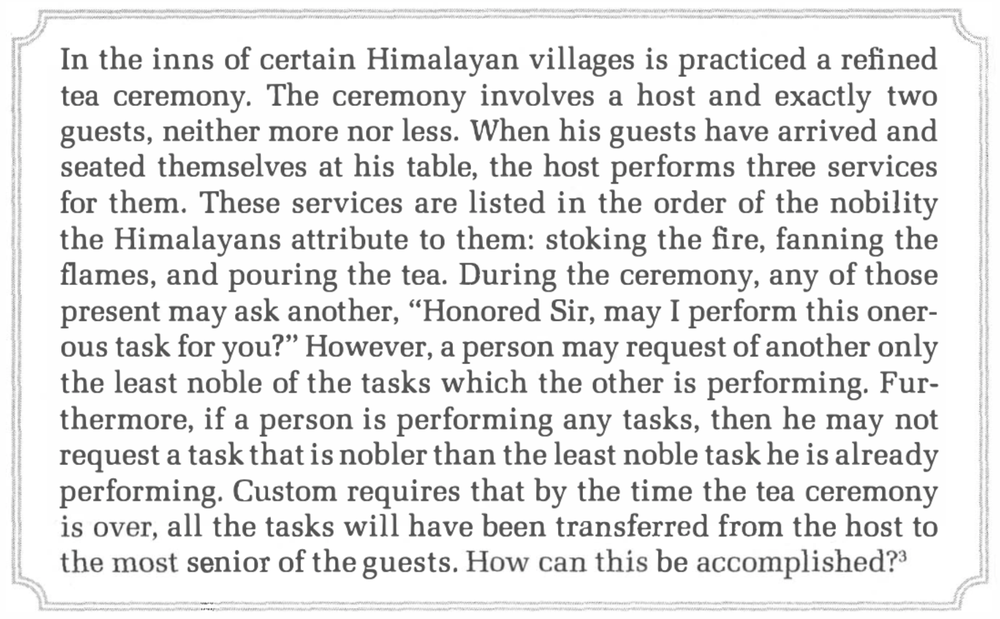
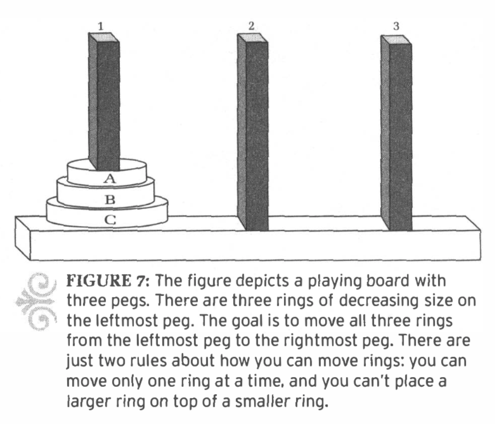

```{r setup, include=FALSE, warning=FALSE}
knitr::opts_chunk$set(message = FALSE, 
                      fig.align = "center",
                      fig.retina = 3,
                      warning = FALSE)

library(tidyverse)
library(emo)
library(lorem)
library(xaringanthemer)
library(countdown)
source("https://raw.githubusercontent.com/andrewpbray/stat-375-website/master/xaringan-theme.R")
```

---
## While you're waiting

Please get into groups of 3-4 and introduce yourselves if there is someone you don't know.

---
## Agenda

1. Course structure
2. Reflections from teaching
3. Curating attention
4. The limits of working memory
5. Concrete strategies
6. Making long-term memories


---
class: middle, center, inverse

#Course Structure

---
## New space, smaller classes

**Undergraduates**: Meet in Evans 330

**Graduates**: Meet in Evans 340

Same content, same Ed, different facilitator. Class will be 1.5 - 2 hours.

---
## Grading

This course is P/NP. A passing grade indicates that you have

1. attended class regularly, 
2. submitted weekly assignments, and 
3. joined in two sets of teaching observations.

--

We will look over your assignments each week and indicate `r emo::ji("heavy_check_mark")`, `r emo::ji("heavy_check_mark")`+, `r emo::ji("heavy_check_mark")`-.

--

Mid-semester, we will schedule short one-on-one meetings to discuss how your teaching is going.


---
## Platforms

**Ed**: Course communication, discussion assignments

--

**bCourses**: Posting assignments, submitting assigments, readings

--

**Course website**: stat375.netlify.app contains materials (perpetually under construction).


---
## Community Standards

Status update


---
class: middle, center, inverse

# Reflections from teaching

---
## Reflections from teaching

.task[
Please share

1. One thing that went well
2. One thing that went poorly
3. One thing you learned
]

```{r echo = FALSE}
countdown(minutes = 10, bottom = 0)
```

---
class: middle, center

## Take homes from today

--

.adage[As a teacher, you are a curator of **attention**.]

--

.adage[Beat the limits of working memory by **chunking**.]

--

.adage[**Memory** is the residue of thought. (and practice helps)].

---
class: center, middle, inverse

# Curating attention

---

<center>
<iframe width="1120" height="630" src="https://www.youtube.com/embed/IGQmdoK_ZfY?start=4" title="YouTube video player" frameborder="0" allow="accelerometer; autoplay; clipboard-write; encrypted-media; gyroscope; picture-in-picture" allowfullscreen></iframe>
</center>

---
## Model of Thinking

```{r echo = FALSE, out.width = "55%"}
knitr::include_graphics("figs/model-of-thinking.jpeg")
```
.cite[Source: Dan Willingham]

---
## Attention

**Attention** determines which aspects of our environment enter short term memory.


---
## Class Questions

.pull-left[
.task[
1) As a *student*, when / why have you become inattentive in class?
]
]

.pull-right[
.task[
2) As a *teacher*, when / why have you misdirected student attention?
]
]


???
things that might come up for students:
- sources of distraction
- "boredom" - content too easy or too hard
- focusing on other events in life

things that might come up for teachers:
- tangents, drifting away from learning goals
- (fear of) loss of credibility by students

---
# Siege of Breda

The siege of Breda of 1624–25 occurred during the Eighty Years' War. The siege resulted in Breda, a Dutch fortified city, falling into the control of the Army of Flanders.

Following the orders of Ambrogio Spinola, Philip IV's army laid siege to Breda in August 1624. The siege was contrary to the wishes of Philip IV's government because of the already excessive burdens of the concurrent Eighty and Thirty Years' wars. The strategically located city was heavily fortified and strongly defended by a large and well prepared garrison of 7,000 men, that the Dutch were confident would hold out long enough to wear down besiegers while awaiting a relief force to disrupt the siege.

.cite[Source: Wikipedia]

---
# Siege of Breda, cont.

Yet despite the Spanish government's opposition to major sieges in the Low Countries and the obstacles confronting any attack on such a strongly fortified and defended city, Spinola launched his Breda campaign, rapidly blocking the city's defences and driving off a Dutch relief army under the leadership of Maurice of Nassau that had attempted to cut off the Spanish army's access to supplies. 

The siege of Breda is considered Spinola's greatest success and one of Spain's last major victories in the Eighty Years' War. The siege was part of a plan to isolate the Republic from its hinterland, and co-ordinated with Olivare's naval war spearheaded by the Dunkirkers, to economically choke the Dutch Republic. Although political infighting hindered Spinola's freedom of movement, Spain's efforts in the Netherlands continued thereafter.

---
background-image: url(figs/velasquez.jpeg)
background-position: center;
background-repeat: no-repeat;
background-size: contain;  

<!-- The Surrender at Breda by Velasquez --> 

---
background-color: #000000


---
# The Siege of Breda

1. Where is Breda?
--
_Netherlands_

--

1. Which two wars were going on at this time?
--
_Eighty Years War and Thirty Years War._

--

1. What is the name of the painting?
--
_The Surrender of Breda._

--

1. Why was the Siege of Breda important?
--
_Restored the pride and reputation of the spanish army_.


---
# Curating Attention

Some tips:

1. Visuals tend to override audio.
1. What you omit is as important as what you include.
1. Pick 1-3 take-homes and check that everything students see/hear ties back to them.

Did you read this slide or listen to it being read?

---
class: middle, center
### Take home #1

.adage[A teacher is a curator of **attention**.]


---
class: center, middle, inverse

# The Limits of Working Memory

---

<center>
<iframe width="1120" height="630" src="https://www.youtube.com/embed/CgR5mSAGxtA?start=2162" title="YouTube video player" frameborder="0" allow="accelerometer; autoplay; clipboard-write; encrypted-media; gyroscope; picture-in-picture" allowfullscreen></iframe>
</center>

???
Felienne Hermans is a scientist working at Leiden University as an associate professor. Her research interest include programming education and spreadsheets.

36:02 - 44:12: Cognitive Load
44:12 - 50:00: Explicit strategies for programming

---
## Model of Thinking

```{r echo = FALSE, out.width = "55%"}
knitr::include_graphics("figs/model-of-thinking.jpeg")
```


---
## Working Memory

**Working Memory** holds the information - from the environment and from long term memory - that that you can actively think about. Site of consciousness and awareness.

--

**Chunking** is the process of compressing several bits of information into a single bit.

--

<center>
`r emo::ji("smile_cat")` `r emo::ji("heart")` `r emo::ji("cake")`
</center>

---
## Group Discussion

.task[
With your group, come up with a list of **5 strategies** that help students chunk the information to make more room in working memory.
]

```{r echo = FALSE}
countdown(minutes = 5, bottom = 0, font_size = "2em")
```

---
## Example from the reading

```{r echo = FALSE, out.width = "75%"}

```

```{r echo = FALSE}
countdown(minutes = 1, bottom = 0, font_size = "2em")
```

---
## Example from the reading

```{r echo = FALSE, out.width = "55%"}

```

```{r echo = FALSE}
countdown(minutes = 1, bottom = 0, font_size = "2em")
```

???
Follow up questions:
- How does this relate to cognitive load?
- What does this tell us about using word problems?

---
## Example from this class

--

.pull-left[
```{r echo = FALSE, out.width = "100%"}
knitr::include_graphics("figs/model-of-thinking.jpeg")
```
]

.pull-right[
#### Slides vs. Boardwork
How does board work affect _attention_?

How does it affect _cognitive load_?
]


---
class: middle, center
### Take home #2

.adage[Beat the limits of working memory by **chunking**.]


---
class: middle, center
## Concrete Strategies

---
## Concrete Strategies

.task[

Read through the handout and then with your group share two teaching strategies that you could see yourself using to guide attention and memory.

]

```{r echo = FALSE}
countdown(minutes = 8, bottom = 0)
```

---
class: middle, center, inverse

## Making Long-term Memories


---
class: middle, center, inverse

# Recap

---
class: middle, center

.adage[As a teacher, you are a curator of **attention**.]

--

.adage[Beat the limits of working memory by **chunking**.]

--

.adage[**Memory** is the residue of thought. (and practice helps)].

