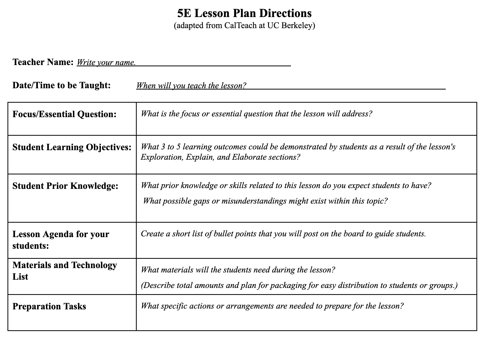
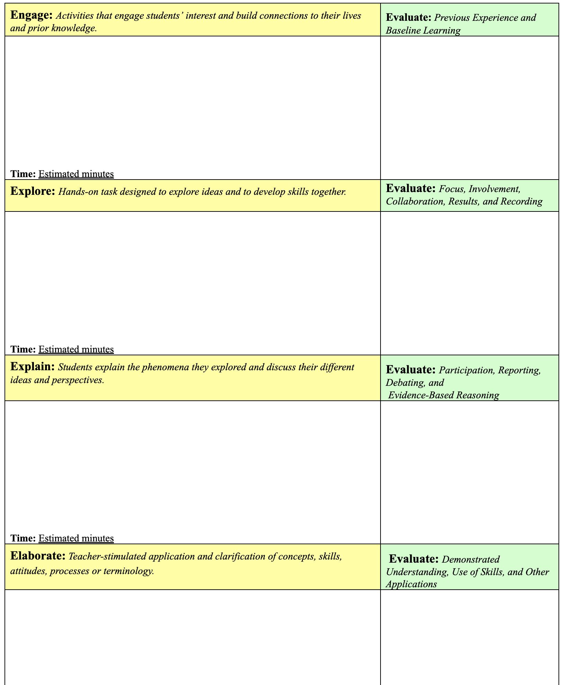

```{r setup, include=FALSE, warning=FALSE}
knitr::opts_chunk$set(message = FALSE, 
                      fig.align = "center",
                      fig.retina = 3,
                      warning = FALSE)

library(tidyverse)
library(emo)
library(lorem)
library(xaringanthemer)
library(countdown)
source("https://raw.githubusercontent.com/andrewpbray/stat-375-website/master/xaringan-theme.R")
```

## While you're waiting

Please get into groups of 3-4 and introduce yourselves if there is someone you don't know.

???

1. On their own: 5 min do stickies
2. slides: 5E
3. In pairs 5 min: share stickies, label each with the appropriate E
4. slides: show lesson planning form
5. 15 min / 15 min, take turns filling out lesson plan, moving/adding components as needed.
6. Discussion of 5E
  - What works, what doesn't?
  - What class venues (forum, lecture, lab, disc) work best for each?

---
## Agenda

1. Reflections from teaching
2. Recap from last time
3. A method for reflective teaching
4. Practice: the 5E learning cycle
5. Lesson plan examples from Cal


---
class: middle, center, inverse

# Reflections from teaching

---
## Reflections from teaching

.task[
In your groups, take turns sharing:

1. One thing that went well
2. One thing that went poorly
3. One thing you learned
]

```{r echo = FALSE}
countdown(minutes = 10, bottom = 0)
```

---
class: middle, center, inverse

# Recap

---
## Model of Thinking

```{r echo = FALSE, out.width = "55%"}

```
.cite[Source: Dan Willingham]


---
class: middle, center

.adage[As a teacher, you are a curator of **attention**.]

--

.adage[Beat the limits of working memory by **chunking**.]

--

.adage[**Memory** is the residue of thought. (and practice helps)].


---
## Attention

.pull-left[
"far too much material to get through in the amount of time I had"

"[students] start working on the lab during the discussion portion"

"they also have other notifications or tabs open on their computer"
]

--

.pull-right[
"created a discussion takeaway slide"

"actively see code succeed/fail"
]

---
## Working Memory

.pull-left[
"dissection of notation in statistics" / "term was new and they weren't used to the jargon" / "abundance of definitions involved with this concept"

"very dense with a lot of words"

"class hadn’t even watched the relevant lecture yet"
]

--

.pull-right[
"wanted to do a quick summary ... But I ended up finding myself doing a mini lecture"

"great amount of information that I presented in a short time"

"reiterate general ideas before moving on to another topic"
]

---
class: center, middle, inverse

## A Method for Reflective Teaching

---

```{r echo = FALSE, out.width="30%"}
knitr::include_graphics("https://upload.wikimedia.org/wikipedia/commons/a/a8/Peanut-Butter-Jelly-Sandwich.jpg")
```

You are tasked with teaching someone else how to make a peanut butter and jelly sandwich.

.task[
How would you start? What would you do first?
]

```{r echo = FALSE}
countdown(minutes = 1, bottom = 0)
```

--

.pull-left-wide[
Please contribute your answer at `pollev.com/andrewbray088`.
]

--

.cite[
Evan-Amos, Public domain, via Wikimedia Commons
]

---
## Breaking it down

Think about the last class session you taught.

--

.task[
- Identify the **distinct pieces** of this session (e.g. gave a quiz, mini-lecture on topic X, review solution to problem Y)
]

--

.task[
- Record each of these pieces on a post-it note and lay them out in front of you in the order they were taught.]


---
## Example

```{r echo = FALSE, out.width="100%"}

```

---
## Breaking it down

Think about the last class session you taught.

.task[
- Identify the **distinct pieces** of this session (e.g. gave a quiz, mini-lecture on topic X, review solution to problem Y)
]

.task[
- Record each of these pieces on a post-it note and lay them out in front of you in the order they were taught.]

```{r echo = FALSE}
countdown(minutes = 5, bottom = 0)
```

---
If learning is about changing the brain, then students ...

--

1. must be awake, attending, and interested.

--

2. need to activate related knowledg/memories/circuits so they can connect these to new understandings.

--

3. are only then likely ready for constructing new knowledge/circuits.

--

4. need opportunities to _practice_ using new ideas in new contexts.

--

5. need opportunities to self-assess their understanding and identify confusions.

---
class: center

## One Method: the 5E Learning Cycle Model

.huge[Engage]

.huge[Explore]

.huge[Explain]

.huge[Elaborate]

.huge[Evaluate]

---
If learning is about changing the brain, then students ...

1. **Engage**: must be awake, attending, and interested.

2. **Explore**: need to activate related knowledge/memories/circuits so they can connect these to new understandings.

3. **Explain**: are only then likely ready for constructing new knowledge/circuits.

4. **Elaborate**: need opportunities to _practice_ using new ideas in new contexts.

5. **Evaluate**: need opportunities to self-assess their understanding and identify confusions.

--

.pull-left-wide[
.task[
In pairs, take turns sharing each piece of your lesson and classifying them by their E.
]
]

```{r echo = FALSE}
countdown(minutes = 5, bottom = 0)
```


---
## Planning with 5E Learning Cycle Model

--

```{r echo = FALSE, out.width="70%"}

```

---

```{r echo = FALSE, out.width="50%"}

```

---
## Planning with 5E

This is your chance to practice rebuilding your lesson using this particular planning structure.

.task[
In pairs, work to fill out both pages to redesign one person's lesson according to the 5E framework. After 15 minutes, switch over and redesign the other person's lesson.
]

```{r echo = FALSE}
countdown(minutes = 30, bottom = 0)
```

---
class: center, middle

# Discussion

???
Questions

1. Which components of the 5E cycle were most dominant in your lesson?
2. Which component was the most difficult to fit in to your lesson?
3. Most courses have several elements: lecture, lab, discussion, a class forum. Are there elements that are more natural fits for each component?
4. What do you like about the 5E framework?
5. What do you think is missing, misguided, or challenging about the 5E framework?

---
class: center, middle, inverse

# Lesson Plan Examples from Cal


---

.pull-left[
```{r echo = FALSE, out.width="100%"}
# from Math 1A
knitr::include_graphics("figs/plan1A.png")
```
]

.pull-right[
```{r echo = FALSE, out.width="100%"}
knitr::include_graphics("figs/plan1B.png")
```
]

---
## Strategies inspired by the 5E model

Every GSI is operating within different constraints. Start small. Try changing just one thing.

--

- Start your class with something that engages students and elicits prior knowledge.

--

- Allow for exploration _before_ you explain or give mini-lectures.

--

- Collect some form of assessment (informal is ok!) from your students every class.


