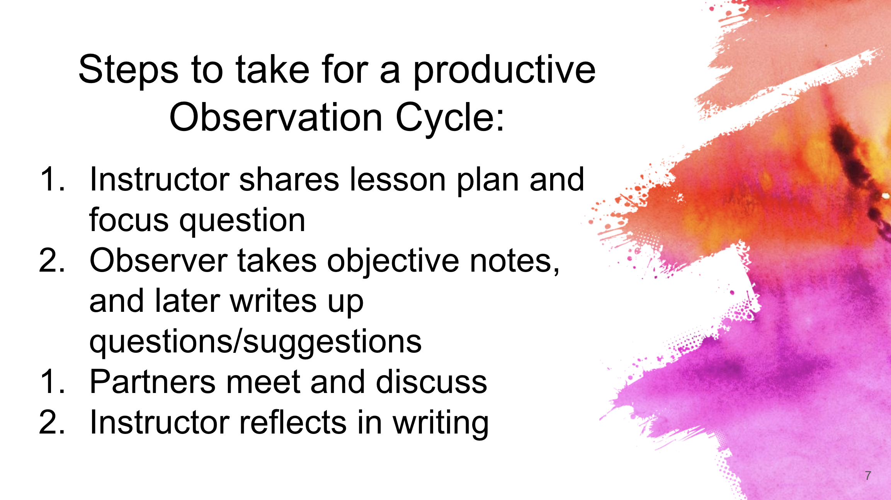

```{r setup, include=FALSE, warning=FALSE}
knitr::opts_chunk$set(message = FALSE, 
                      fig.align = "center",
                      fig.retina = 3,
                      warning = FALSE)

library(tidyverse)
library(emo)
library(lorem)
library(xaringanthemer)
library(countdown)
source("https://raw.githubusercontent.com/andrewpbray/stat-375-website/master/xaringan-theme.R")
```

## Agenda

1. Reflections from teaching
2. Guest: Jake Spertus, Grad Student Union
3. Teaching observation debrief
4. Break
4. Teaching as a team
  - Your role
  - Members of a team at Cal
  - Teaming well and not so well
  - Suggestions for success

---
class: middle, center, inverse

# Reflections from teaching

---
## Reflections from teaching

.task[
In your groups, take turns sharing:

1. One thing that went well
2. One thing that went poorly
3. One thing you learned
]

```{r echo = FALSE}
countdown(minutes = 10, bottom = 0)
```

---
class: middle, center, inverse

# Teaching Observation Discussion

---

```{r echo = FALSE}

```

---

## Teaching Observation Debrief

### Goals
- Provide feedback from observed class
- Venue for discussion about teaching strategies

--
    
### Format
1. Spend 10 minutes discussing instructor 1's class session.
2. Spend 10 minutes discussing instructor 2's class session.

_Person with a longer first name will be instructor 1._

---
## Debrief Instructor 1

1. Instructor 1
    - What was your impression of the class? 
    - What were the strengths?
    - Where are you seeking suggestions for improvement?

--
2. Observer
    - What went well?
    - Constructive but gentle suggestions. "I noticed that ... I wonder if..."
    - Avoid bland general feedback. Focus on specific and actionable.
    - Share observation form
    
--

3. Discuss: Instructor takes notes on form

--

```{r echo = FALSE}
countdown(minutes = 10, bottom = 0)
```

---
## Debrief Instructor 2

1. Instructor 2
    - What was your impression of the class? 
    - What were the strengths?
    - Where are you seeking suggestions for improvement?

--
2. Observer
    - What went well?
    - Constructive but gentle suggestions. "I noticed that ... I wonder if..."
    - Avoid bland general feedback. Focus on specific and actionable.
    - Share observation form
    
--

3. Discuss: Instructor takes notes on form

--

```{r echo = FALSE}
countdown(minutes = 10, bottom = 0)
```

---
???

## Large group discussion questions
- As the teacher, what was the most useful part of this process for you?
- As the observer, what would you like to improve for next time?

---

```{r echo = FALSE}

```

---
## Last Step

- Take your observation form with notes and type up reflection as part of next assignment to be posted to bCourses.

--

## Break!

```{r echo = FALSE}
countdown(minutes = 5, bottom = 0, play_sound = TRUE)
```


---
class: middle, center, inverse

# Teaching as a Team

---

# The Instructor Perspective

- "core and main engine of the course"
- "create quiz/exam questions"
- "in charge of leading section"
- "empathise with students"
- "instructors' eyes and ears"
- "timely, fair and accurate grading of problem sets"
- "My jobs are similar to yours except that I am giving lectures not lab sessions"
- No response (most common!)

---
## The Role of a GSI

Threee-Five roles emerged

### Facilitator

### Grader

###3 balkd

Decide which on of these you most identify with.

---
## Discuss

Find 2-3 other people who tend to view their roles differently and answer.

1. 
2. 
3. 


---
## Teaching as a Team: Well

Consider a specific aspect of or incident in your working relationship with your teaching team that has gone _well_.

1. Think: write a short description on the padlet.
2. Pair: share your experience with a partner and discuss.
3. Share: whole class discussion.

---
## Teaching as a Team: Well

Consider a specific aspect of or incident in your working relationship with your teaching team that has gone _well_.

1. Think: write a short description on the padlet.

```{r echo = FALSE, fig.height=4.8}
library(qrcode)
qr <- qr_code("https://padlet.com/andrewbray1/pum0u6v2gwtwzme")
plot(qr)
```

```{r echo = FALSE}
countdown(minutes = 1.5, bottom = 0)
```


---
## Teaching as a Team: Well

Consider a specific aspect of or incident in your working relationship with your teaching team that has gone _well_.

1. Think: write a short description on the padlet.
2. Pair: share your experience with a partner and discuss.
3. Share: whole class discussion.

---
## Teaching as a Team: Poorly

Consider a specific aspect of or incident in your working relationship with your teaching team that has gone _poorly or could be improved_.

1. Think: write a short description on the padlet.
2. Pair: share your experience with a partner and discuss.
3. Share: whole class discussion.

---
## Teaching as a Team: Poorly

Consider a specific aspect of or incident in your working relationship with your teaching team that has gone _poorly or could be improved_.

1. Think: write a short description on the padlet.

```{r echo = FALSE, fig.height=4.8}
library(qrcode)
qr <- qr_code("https://padlet.com/andrewbray1/57fhfb1azomqzv1s")
plot(qr)
```

```{r echo = FALSE}
countdown(minutes = 1.5, bottom = 0)
```


---
## Teaching as a Team: Poorly

Consider a specific aspect of or incident in your working relationship with your teaching team that has gone _poorly or could be improved_.

1. Think: write a short description on the padlet.
2. Pair: share your experience with a partner and discuss.
3. Share: whole class discussion.

---
## Suggestions: Communication

- Don't be afraid to ask questions!
- Reach out to other staff if you can't complete a task or don't know how
- Regularly check in with your AIs/tutors/graders
    - Ensure that you yourself are approachable as well
- But don't forget to set boundaries!

---
## Suggestions: Structure

- Responsibilities of team members
  - Clear
- Meetings
  - _Inherit existing power dynamics_.
  - Agenda
  - Assign roles
