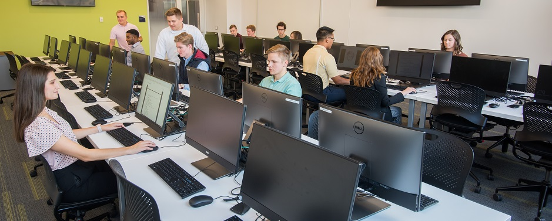
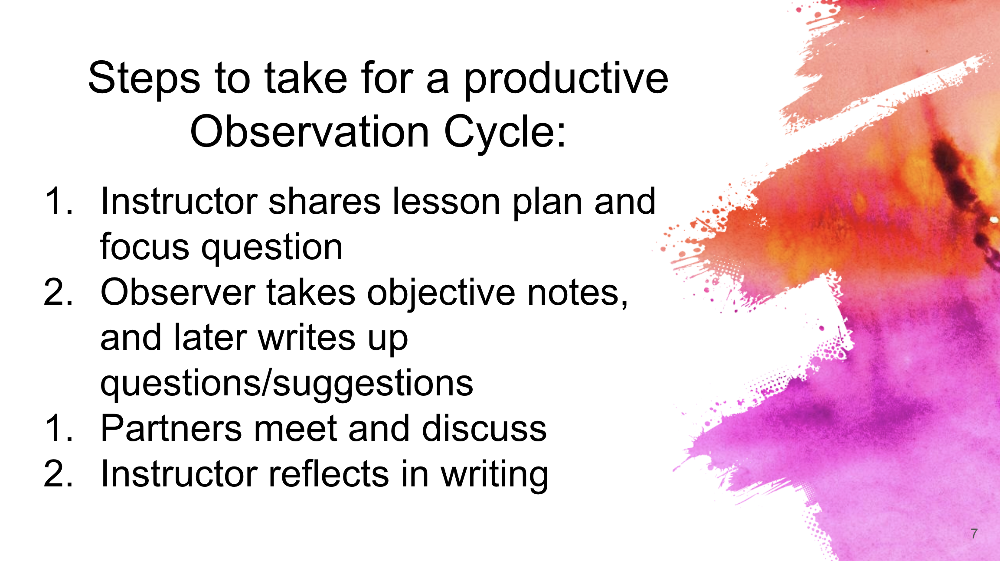

```{r setup, include=FALSE, warning=FALSE}
knitr::opts_chunk$set(message = FALSE, 
                      fig.align = "center",
                      fig.retina = 3,
                      warning = FALSE)

library(tidyverse)
library(emo)
library(lorem)
library(xaringanthemer)
library(countdown)
source("https://raw.githubusercontent.com/andrewpbray/stat-375-website/master/xaringan-theme.R")
```

## Agenda

1. Think before you compute
  - The curse of small curiosities
  - Lesson plan case study: Student Evals
  - Debrief
2. Break
3. Teaching observation debrief

---
class: middle, center

### Consider the lab...

---

## What should the students be doing?
--

```{r echo = FALSE, out.width="80%"}

```
.cite[source: https://www.uakron.edu/cba/student-resources/cba-computer-labs/]
]

???
Should they be:
- working solo, in groups?
- reading / learning?
- answering questions?
  - what level of blooms?
  - questions about tools? context? concepts?
  
---
## Think before you compute

**Premise**: when put in a computing environment with data, certain processes falter:
--

- If they have an uncertain background, students flail

--
- "hacking" mentality can take over

--
- Tunnel vision

---
## Think before you compute

.pull-left[
### Part I
- No computers
- Think-pair-share
- Understand questions and data collection
- Prepare expectations around data structure
]
--
.pull-right[
### Part II
- Computers + Data
- Verify data structure
  - Make plots
  - Conduct analysis
- Some think-pair-share structure
- Tie back to part I
]

---

class: center, middle

# Part I

.adage[Please put all laptops away.

You won't need them today.]

---
## Getting Started

- Please form pairs or trios

- Move around seats as needed

- Introduce yourself to anyone you don't know


---
## Work flow for today

We'll work through a scientific article page by page. For each few pages, I'll pose a few questions here and you will...

1. work silently by yourself on the questions, writing notes on the article, 

1. discuss your answers as a group,

1. share your answers if I call on you after most groups are done.

Then we'll repeat this cycle to work through all/most of the questions for the first half of the lab.

---

1. _**General**: As you read through the article, note here any words or acronyms that you were not familiar with before and provide their definition._

---

1. **Abstract**: Which finding strikes you as the most important? Why?

1. **Abstract**: Based on the results summarized here, what do you believe was the overarching research question that the scientists were wondering about when they devised this study?

1. **Background**: Why is a student's answer to "How effective was the instructor?" not always helpful in understanding how effective the instructor was?

1. **Background**: What is the general statement of the null hypothesis that is applied to every analysis in this paper?

1. **Background**: What do the results of this study indicate about the relative impact of the teaching effectiveness and perceived gender on SET?

```{r echo = FALSE}
countdown::countdown(5)
```


---

1. **Data**: Based on the description in the paper, sketch/speculate what the US experimental data frame might look like. Be sure to note the unit of observation, the number of rows and columns, that names of the variables, their data type, and the values they can take.

```{r echo = FALSE}
countdown::countdown(7)
```

---

1. **Methods**: Sketch/speculate what a plot could look like of the relationship between the Prompt SET scores and reported instructor gender. This should be a plot of the full data set and should be consistent with the statistics shown in table 8. Repeat the exercise for the Responsive SET scores and reported instructor gender.

```{r echo = FALSE}
countdown::countdown(7)
```

---
class: center, middle

# Part II

.adage[Today you will use your laptops.]

---

The authors of this manuscript ensured that their analysis is fully reproducible by making their manuscript, data, and code easily available at `https://github.com/kellieotto/SET-and-Gender-Bias`. You can load the data from the US experiment with:

```{r eval = FALSE, echo = TRUE}
library(tidyverse)
set <- read_csv("https://bit.ly/3vPsnFL")
```

12. What is the unit of observation in the data frame? What are the dimensions of the data frame? How many students from each section filled out evaluations (at least partially)?

```{r eval = TRUE, echo = FALSE}
countdown::countdown(6)
```

---

14. Use the plots that you drew in question 11 as inspiration for constructing two plots of the actual data: the relationship between Prompt SET and reported TA gender, and the relationship between Responsive SET and reported TA gender. Describe each pair of plots: how does the rating for each differ based on the reported instructor gender?

```{r eval = TRUE, echo = FALSE}
countdown::countdown(5)
```

---

17. **Conclusion**: Do you find that the arguments in this section of the manuscript are consistent with the results of their data analysis? Do you find that they're consistent with your own experience with evaluating instructors?

```{r eval = TRUE, echo = FALSE}
countdown::countdown(3)
```

---
## Debrief
What worked? what didn't?

.pull-left[
### Part I
- No computers
- Think-pair-share
- Understand questions and data collection
- Prepare expectations around data structure
]

.pull-right[
### Part II
- Computers + Data
- Verify data structure
  - Make plots
  - Conduct analysis
- Some think-pair-share structure
- Tie back to part I
]
---

## Break!

When you return, please sit next to your observation partner.

```{r echo = FALSE}
countdown(minutes = 5, bottom = 0)
```

---
class: middle, center, inverse

# Teaching Observation Discussion

---

```{r echo = FALSE}

```

---

## Teaching Observation Debrief

### Goals
- Provide feedback from observed class
- Venue for discussion about teaching strategies

--
    
### Format
1. Spend 10 minutes discussing instructor 1's class session.
2. Spend 10 minutes discussing instructor 2's class session.

_Person with a longer first name will be instructor 1._

---
## Debrief Instructor 1

1. Instructor 1

    - What was your impression of the class? 
    - What were the strengths?
    - Where are you seeking suggestions for improvement?

--
2. Observer
    - What went well?
    - Constructive but gentle suggestions. "I noticed that ... I wonder if..."
    - Avoid bland general feedback. Focus on specific and actionable.
    - Share observation form
    
--

3. Discuss: Instructor takes notes on form

--

```{r echo = FALSE}
countdown(minutes = 10, bottom = 0)
```

---
## Debrief Instructor 2

1. Instructor 2

    - What was your impression of the class? 
    - What were the strengths?
    - Where are you seeking suggestions for improvement?

--
2. Observer
    - What went well?
    - Constructive but gentle suggestions. "I noticed that ... I wonder if..."
    - Avoid bland general feedback. Focus on specific and actionable.
    - Share observation form
    
--

3. Discuss: Instructor takes notes on form

--

```{r echo = FALSE}
countdown(minutes = 10, bottom = 0)
```

---
???

## Large group discussion questions
- As the teacher, what was the most useful part of this process for you?
- As the observer, what would you like to improve for next time?

---

```{r echo = FALSE}

```

---
## Last Step

- Take your observation form with notes and type up reflection as part of next assignment to be posted to bCourses.